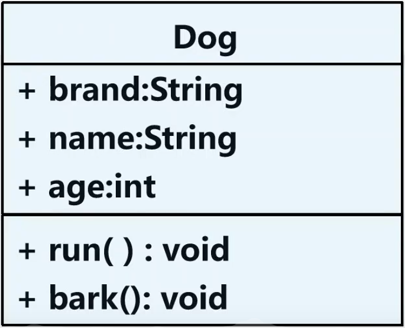
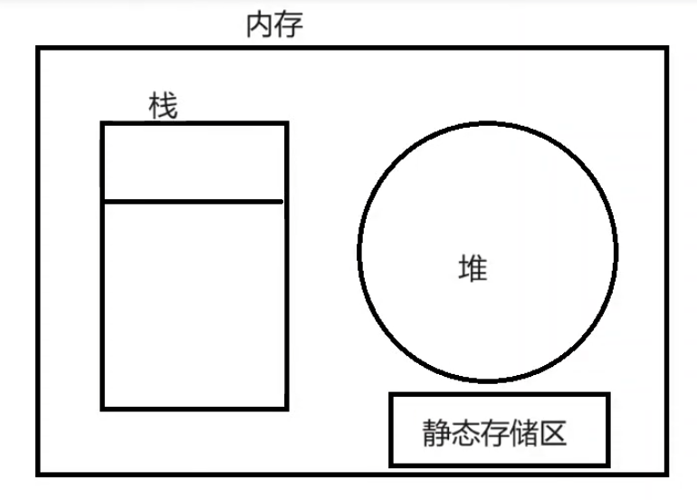
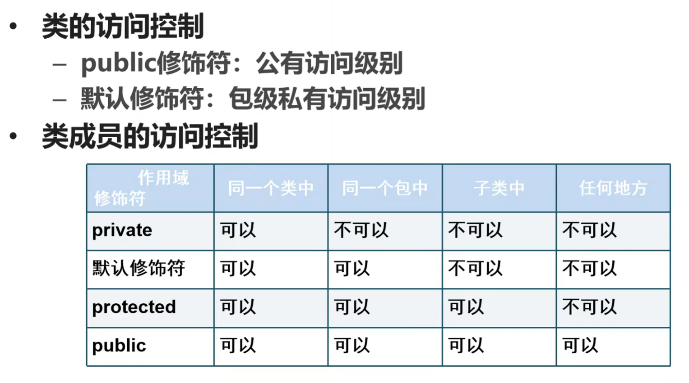

# 抽象和封装

## 1、类提炼的过程

从现实生活中归纳总结出，多种相同对象，具有的相同的特征(属性+方法）提炼到一个容器里，给这个容器起一个名字，这个名字就是类。

三步走：发现类；发现类的属性；发现类的方法。

## 2、类图

我们可以使用类图描述类，进而来分析和设计类；使用类图描述类更加的形象和直观

## 3、构造方法

- 构造方法主要用于完成对象的创建工作。
- 系统会提供一个默认的无参构造方法。
- 构造方法的名称与类名相同，构造方法不也能有任何返回类型。 
- 一旦自定义构造方法，系统就不再提供默认的构造方法。

## 4、方法重载

- 有多个方法，他们实现的功能相同，方法名称相同，参数列表（参数类型、参数个数、参数顺序）不同。
- 与返回值和访问修饰符无关。
- 构造方法也可以重载。

## 5、static

### 5.1、static 的使用

使用 static 修饰属性和方法，就可以使用类名直接访问类的属性和方法。

静态成员占用的内存是静态存储区，一个成员一旦变成静态的，它就是类本身所有，且只有一份。它会一直存在内存中，直到程序结束。不能将所有的变量都定义成静态的，占用内存空间很大。

### 5.2、static 代码块

如果有多个静态代码块，会按顺序执行，每个静态代码块只会执行一次。因为类只会加载一次，所有静态成员也只被加载一次。

### 5.3、static 总结

- 静态变量
  - 被static修饰的变量
  - 在内存中只有一个拷贝
  - 类内部，可在任何方法内直接访问静态变量
  - 其他类中，可以直接通过类名访问
- 实例变量
  - 没有被static修饰的变量
  - 每创建一个实例，就会为实例变量分配一次内存，实例变量可以在内存中有多个拷贝，互不影响。

- 静态方法：可以直接通过类名访问
  - 不能直接访问所属类的实例变量和实例方法
  - 可以直接访问类的静态变量和静态方法
- 实例方法：通过创建实例后访问
  - 可直接访问所属类的静态变量、静态方法、实例变量和实例方法。

## 6、封装

### 6.1、封装的理解

- 封装是面向对象的三大特性之一
- 封装是将类的某些信息隐藏在类的内部，不允许外部程序直接访问，而是通过该类提供的方法来实现对隐藏信息的操作和访问。
- 优点：隐藏类的实现细节；只通过规定的方法访问数据。

### 6.2、使用封装的过程

- 将属性的可见性设为private
- 创建共有的 getter 和 setter 方法  (可使用alt+enter快速创建)
- 在 getter 和 setter 方法中加入判断语句

### 6.3、封装的两种体现

一个类中可以出现类成员变量和成员方法

将私有的成员变量封装成公有的 getter 和 setter 方法

## 7、this用法

当参数名称与成员名称相同时，可以使用 this 关键字表示成员变量

## 8、导入包

为了使用不在一个包中的类，需要在 Java 程序中使用 import 关键字导入这个类

注意事项

- 一个类同时引用了两个来自不同包的同名类，必须通过完整的类名来区分。
- package 和 import 的顺序时固定的。package 必须位于第一行；只允许有一个 package 语句；其次时 import；接着是类的声明。

## 9、访问控制

- public：      当前类，当前包，子类，不同包
- protected：当前类，当前包，子类
- 默认：          当前类，当前包
- private：     当前类

