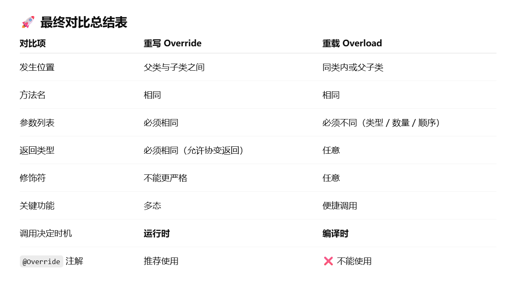

# 类的继承

## 1、继承的用法

继承是代码重用的一种方式。

可以在idea中查看类继承关系【show diagrams】

**注意事项：**

- 在Java中类只支持单继承，不支持多继承
- 符合 is-a 关系的场景下可以使用继承
- 子类不能继承父类的内容
  - private 成员
  - 子类与父类在不同包，且使用默认访问修饰符的成员
  - 构造方法

初始化顺序：父类属性--->父类构造--->子类属性--->子类构造

## 2、子类重写父类的方法

**重写规则：**

- 方法名相同
- 参数列表相同
- 返回值类型相同 或 该返回值类型的子类
- 访问修饰符不能比父类更严格（可更宽）
- 不能抛出比父类更宽的异常
- 发生在**父类与子类之间**

**方法重写与方法重载的不同：**

- **重写 override**：子类重新定义父类的同名方法，用于**实现多态**
- **重载 overload**：同一个类中定义多个同名但参数不同的方法，用于**增强方法功能**
- 

## 3、super 的使用

super 用于访问父类成员

super 不能访问父类的私有成员

super 调用父类构造方法时，必须写在子类构造方法中的第一行

注意：this 是当前类的对象，super 是父类的对象

## 4、Object 类

Object 类是所有类的父类，任何类都继承自 Object 类

**以下方法经常被子类重写：**

- toString()：返回当前对象本身的有关信息，按字符串对象返回
- equals()：比较两个对象是否是同一个对象，是则返回true

## 5、抽象类和抽象方法

Java中抽象类使用 abstract 修饰，抽象方法也使用 abstract 修饰

抽象类的核心用途：

- **定义共性**：抽象出子类共同拥有的属性和方法
- **定义规范**：要求子类必须实现某些方法（抽象方法）
- **代码复用**：在抽象类中实现公共逻辑，减少重复代码
- **统一对外接口**：让调用者依赖抽象，而不是具体实现，从而实现多态
- **模板模式**：规定执行流程，具体步骤由子类决定

注意：

- 抽象方法没有方法体。
- 抽象方法必须在抽象类中。
- 抽象方法必须在子类中被实现。除非子类是抽象类。
- 抽象类中可以有非抽象方法。
- 抽象类不能创建对象。

## 6、final的使用

**注意：**

- 使用 final 修饰类不能被继承
- 使用 final 修饰方法不能被子类重写
- 使用 final 修饰变量不可再赋值，必须确保在对象创建完成前被赋值一次

**使用建议：**

- 用于常量和安全性，防止被意外修改

  - ```java
    private static final int CACHE_SIZE = 1024;
    ```

- 防止方法体错误修改入参

  - ```java
    void test(final User user) {
        user = new User(); // ❌ 不能赋新值
    }
    ```

- 框架中常用于模板模式，保护算法骨架

- 确保不可扩展，提高安全性

**与多线程有关的点：**

- `final` 对象的成员在构造完成后具有 **安全发布**
- 使对象构造后的状态对其他线程**立即可见**
- 因此创建不可变对象（Immutable Object）时必须用 `final`

